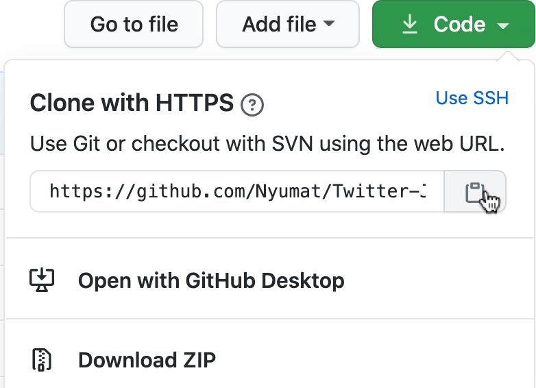

<h1 align="center" style="font-size: 3rem;">The J. Cole Lyric Bot</h1>


<p align="center">This bot is for entertainment purposes, only.</p>

## The Project

This bot is a program that incooperates the [Twitter API](https://developer.twitter.com/en/docs/twitter-api), [BeautifulSoup4](https://www.crummy.com/software/BeautifulSoup/bs4/doc/#), and [Tweepy](https://www.tweepy.org/) to post J.Cole Lyrics derived from [AZLyrics](azlyrics.com) every 30 minutes.

## Building Your Own Bot Instance (OSX)

**To create your own bot instance, the first thing you will need to do is setup your very own virtual enviornment.**

First, make you have the latest version of pip:
```
pip install --upgrade pip
```

Next, download the package:
```
pip  install  virtualenv
```
Create your new enviornment 'optional_name':
```
python -m venv (optional_name)
```
Activate your virtual enviornment: 
```
optional_name/bin/activate
```
To de-activate the enviornment use:
```
decativate
```
Once your virtual enviornment is created, clone the repo.
<br></br>
# To-Do's:

- [ ] Finish Documentation
- [ ] Add Lyrics to stored_lyrics.txt
- [ ] Finish compatibility for external use 

# License

[](http://badges.mit-license.org)

- **[MIT license](http://opensource.org/licenses/mit-license.php)**
